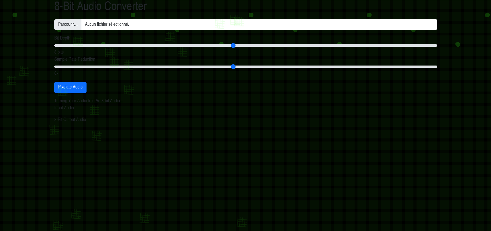

# 🎮 8-Bit Audio Converter

Convertissez n'importe quel fichier audio en son rétro 8-bit avec style ! Un outil web simple et efficace qui transforme vos pistes audio en véritables chefs-d'œuvre pixelisés, le tout dans une interface inspirée de l'ère des Space Invaders.




## ✨ Fonctionnalités

- 🎵 **Conversion Audio 8-Bit** — Transformez n'importe quel fichier audio en son rétro
- 🎛️ **Contrôle de la Profondeur de Bits** — Ajustez de 1 à 16 bits pour un effet plus ou moins cru
- 📉 **Réduction de Taux d'Échantillonnage** — Simulez des fréquences d'échantillonnage basses (1x à 16x)
- 🕹️ **Interface Rétro Gaming** — Design inspiré de Space Invaders avec animations CSS
- 🚀 **Traitement 100% Client** — Aucune donnée n'est envoyée sur un serveur
- 💾 **Export WAV** — Téléchargez le résultat au format WAV standard

## 🚀 Utilisation

1. Ouvrez `8bit_converter.html` dans votre navigateur moderne
2. Chargez un fichier audio (MP3, WAV, OGG, etc.)
3. Ajustez les curseurs **Bit Depth** et **Sample Rate Reduction**
4. Cliquez sur **"Pixelate Audio"**
5. Écoutez et téléchargez votre création 8-bit !

## 🛠️ Technologies

- **HTML5** — Structure sémantique
- **CSS3** — Animations rétro et effets visuels
- **Vanilla JavaScript** — Traitement audio en temps réel
- **Web Audio API** — Décodage et manipulation des buffers audio
- **Tone.js** — Prêt pour des extensions audio futures

## 📁 Structure du Projet

```
.
├── 8bit_converter.html    # Application principale (standalone)
├── screenshot.png         # Capture d'écran de l'interface
├── README.md              # Ce fichier
└── LICENSE                # Licence MIT
```

> **Note** : L'application est entièrement contenue dans un seul fichier HTML. Aucune dépendance locale requise.

## 🎨 Personnalisation

Les paramètres par défaut sont :
- **Bit Depth** : 8 bits
- **Sample Rate Reduction** : 8x

Vous pouvez modifier ces valeurs via les curseurs dans l'interface ou directement dans le code source.

## 🌐 Compatibilité

| Navigateur | Support |
|------------|---------|
| Chrome     | ✅      |
| Firefox    | ✅      |
| Safari     | ✅      |
| Edge       | ✅      |

## 🤝 Contribution

Les contributions sont les bienvenues ! N'hésitez pas à ouvrir une issue ou une pull request.

## 📜 Licence

Ce projet est sous licence MIT. Voir le fichier [LICENSE](LICENSE) pour plus de détails.

---

<p align="center">👾 <em>Fait avec amour pour l'ère 8-bit</em> 👾</p>
